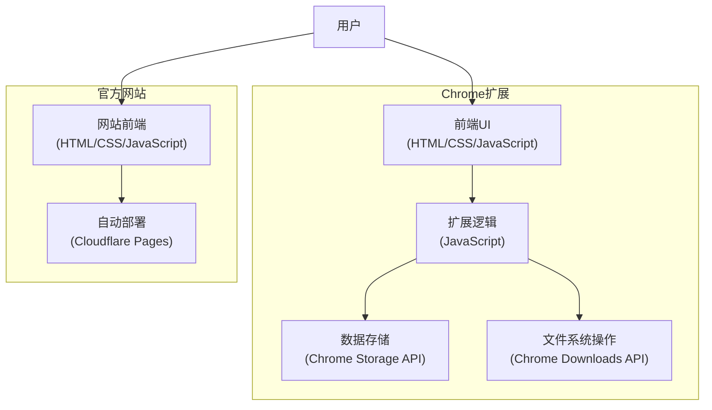
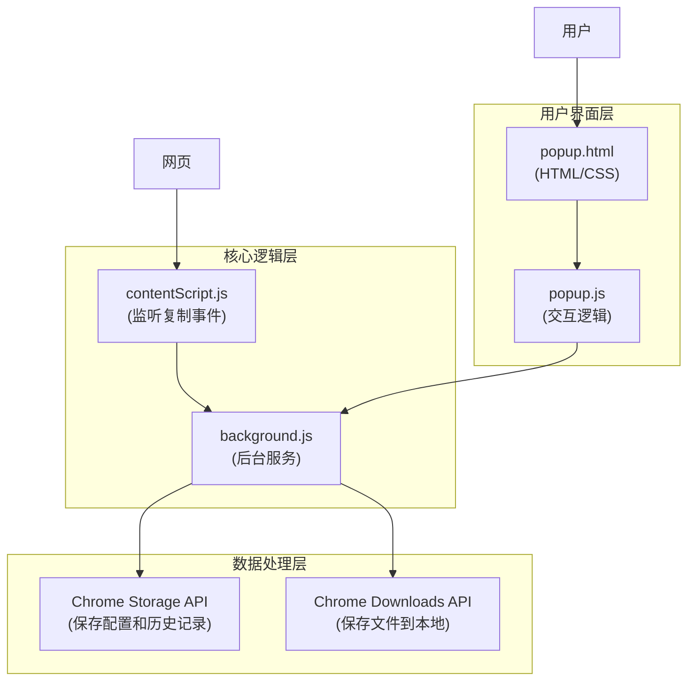
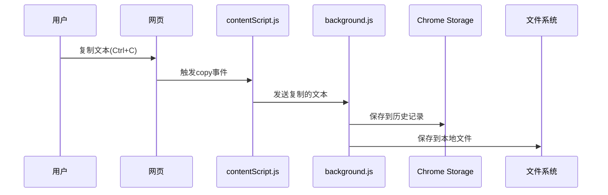
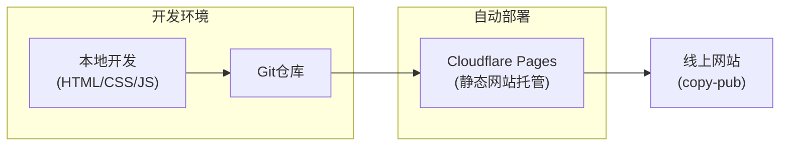
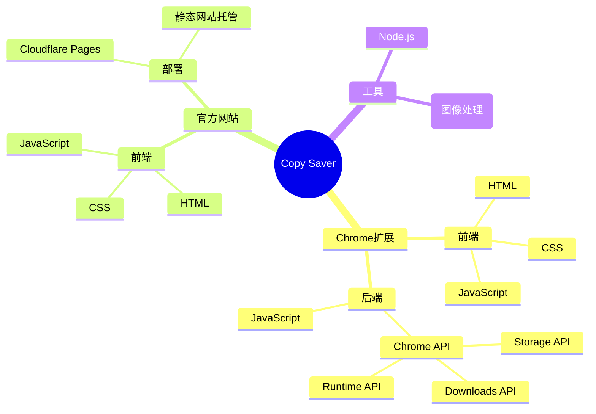

# Copy Saver 技术架构流程图

本文档使用流程图展示了Copy Saver项目的技术架构，包括Chrome扩展的核心组件和网站部署流程。

## 项目整体架构

## Chrome扩展组件详细架构

## 数据流向

## 网站部署流程

## 技术栈总览

## 技术选型说明

- **Chrome扩展API**：利用Chrome提供的扩展API实现核心功能，包括监听复制事件、存储数据和下载文件。
- **JavaScript**：作为主要编程语言，用于实现扩展的所有逻辑功能。
- **HTML/CSS**：用于构建扩展的用户界面。
- **Cloudflare Pages**：用于托管官方网站，提供自动部署功能。
- **Node.js & Sharp**：用于开发过程中的图像处理和构建工具。

通过这种架构设计，Copy Saver实现了一个简单但功能完整的Chrome扩展，能够自动保存用户复制的内容，并提供了用户友好的界面进行配置和管理。